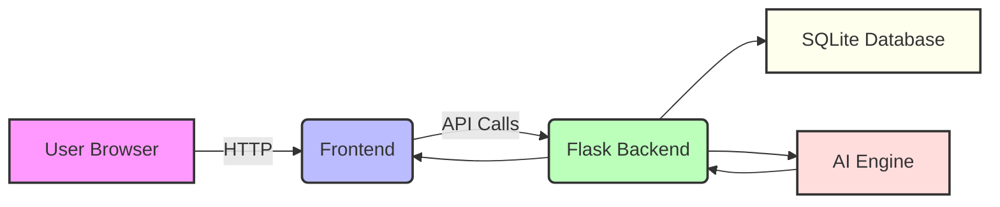

# System Architecture

## Architecture Overview
The `Personalized Workout & Diet Planner with AI` is built as a 3-tier system:

- Frontend: Responsive user interface served as static content.
- Backend: Flask API handling authentication, profile storage, and recommendation logic.
- Database: SQLite for users and profile persistence.
- AI Module: Scikit-learn model plus rule-based engine for workout and meal plans.

## Mermaid Architecture Diagram

## Component Details
- **Frontend**: collects user information, dispatches requests, and displays personalized dashboards.
- **Backend**: exposes REST endpoints for registration, login, profile updates, and AI recommendations.
- **Database**: stores `users` and `profiles` for persistence.
- **AI Engine**: computes BMI, calorie target, and selects workouts and meal plans.
