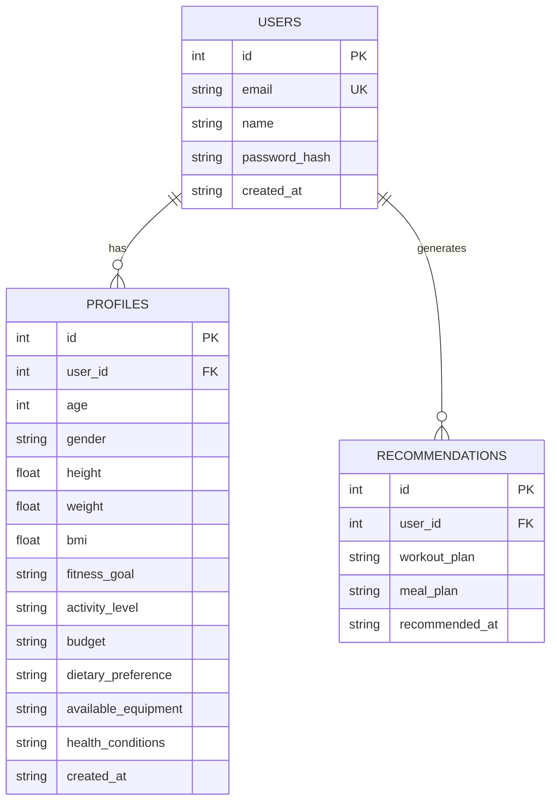

# Database Design & ER Diagram

## ER Diagram (Mermaid)


## SQL Schema

### Users Table
```sql
CREATE TABLE users (
    id INTEGER PRIMARY KEY AUTOINCREMENT,
    email TEXT UNIQUE NOT NULL,
    name TEXT NOT NULL,
    password_hash TEXT NOT NULL,
    created_at TEXT DEFAULT CURRENT_TIMESTAMP
);
```

### Profiles Table
```sql
CREATE TABLE profiles (
    id INTEGER PRIMARY KEY AUTOINCREMENT,
    user_id INTEGER NOT NULL,
    age INTEGER,
    gender TEXT,
    height REAL,
    weight REAL,
    bmi REAL,
    fitness_goal TEXT,
    activity_level TEXT,
    budget TEXT,
    dietary_preference TEXT,
    available_equipment TEXT,
    health_conditions TEXT,
    created_at TEXT DEFAULT CURRENT_TIMESTAMP,
    FOREIGN KEY(user_id) REFERENCES users(id)
);
```

### Recommendations Table
```sql
CREATE TABLE recommendations (
    id INTEGER PRIMARY KEY AUTOINCREMENT,
    user_id INTEGER NOT NULL,
    workout_plan TEXT,
    meal_plan TEXT,
    recommended_at TEXT DEFAULT CURRENT_TIMESTAMP,
    FOREIGN KEY(user_id) REFERENCES users(id)
);
```

## Relationships
- A user can have one fitness profile at a time (1:1 relationship, but implemented as optional 1:0..1).
- A user can have multiple recommendations over time (1:M relationship).
- Profiles and recommendations are always tied to a user via foreign key constraints.
